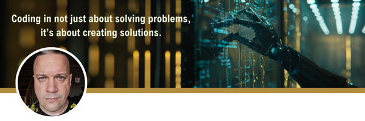

<h1 align="center">Hi 👋, I'm Radek {RadekRo} Rocławski Full-Stack Developer</h1>
<h4 align="center">I am a born coder. If I am involved in a project - I am totally involved. I am aware of the new technologies that is why since 2022 AI is my daily wingman.</h4>
<h6 align="center">I am currently involved in beta testing the AI Copilot in IntelliJ. Be aware that part of my job is in PRIVATE REPOSITORIES due to privacy protection.</h6>

  

- 🔭 I’m currently working on [photo laboratory [backend] application](https://github.com/RadekRo/AnkaraLab-BackEnd)

- 🌱 I’m currently learning: **TypeScript, C#**

- 💬 Ask me about: **React, React Native, Python, JavaScript, TypeScript, C#, .NET, node.js, SQL, HTML, HTMX, CSS, Saas**  and tools like: **VSC, VSC 2022, Postman, Azure Data Studio, Google Play Console for Devs**

- 📫 How to reach me: **radek@roclawski.com**

- 👾 <strong>AI</strong> - I am a daily user of an GitHub Copilot, ChatGPT 4.o and MidJourney (for graphic purposes).

- ⚡ In case of a FIRE I always remember to **git ADD**, **git COMMIT**, **git PUSH** - **LEAVE the BUILDING** ;)**

- 💪 If you would like to support me - buy me a coffee at ☕ [buycoffe.to/radekro](https://buycoffee.to/radekro)

<h3 align="left">Connect with me:</h3>

<h3 align="left">Languages and Tools:</h3>

                       

  <h3>Latest opinion about me: (Feb 2024)</h3>
  <i>Radosław had previous experience with programming. He undertook a year-long full-stack developer course to stay current with technology. He is not afraid to talk about different challenges and technologies. He seeks knowledge on his own and uses  libraries. During the course, he worked on a large project in which he skillfully played a leadership role. He is able to look at the project as a product to play a key role in the business. He is a quick learner, communicative, and aware of the object-oriented nature of code. He is a good candidate to work on a project in terms of code maintenance and communication with the client.</i> 
<h5>/Adrian Widłak, programming menthor/</h5>

